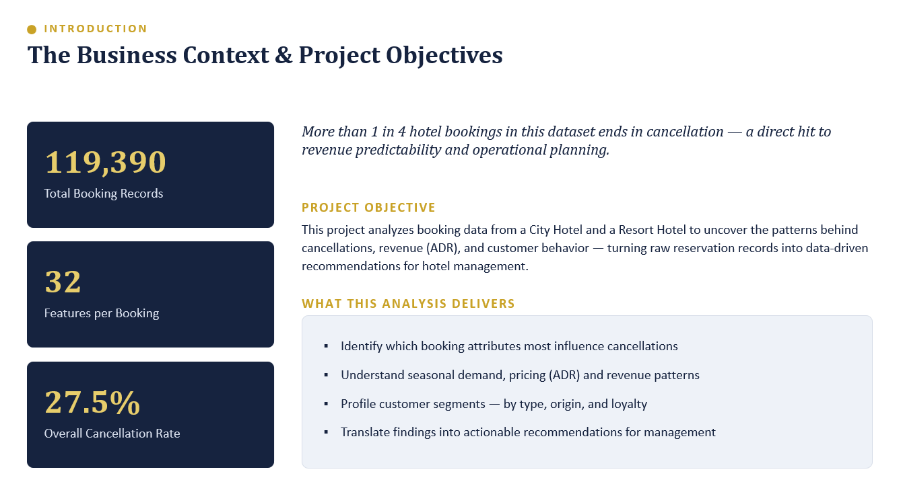

# 🏨 Hotel Booking Analysis — EDA & Strategic Insights
### Uncovering Booking Patterns & Cancellation Drivers Across City and Resort Hotels

---

## 1️⃣ Project Objective

This project analyzes reservation data from a City Hotel and a Resort Hotel to uncover the patterns behind cancellations, revenue (ADR), and customer behavior — turning raw booking records into data-driven recommendations for hotel management.

The analysis was designed to:
- Identify which booking attributes most influence cancellations
- Understand seasonal demand, pricing (ADR), and revenue patterns
- Profile customer segments — by type, origin, and loyalty
- Translate findings into actionable recommendations for management

---

## 2️⃣ Dataset Overview

- **119,390** total booking records (raw)
- **32** features per booking
- **87,377** clean, unique records after deduplication
- **2** hotel types — City Hotel & Resort Hotel
- **177** countries represented among guests
- **106.35** average ADR (Average Daily Rate) across bookings
- **27.5%** overall cancellation rate — more than 1 in 4 bookings ends in cancellation

Data cleaning & preparation included:
- Removal of **32,013 duplicate records** (119,390 → 87,377 unique bookings)
- Imputing missing values — `company`/`agent` → 0, `country` → mode, `children` → median
- Converting `reservation_status_date` from text to a proper datetime format
- Investigating outliers in ADR and guest counts (adults/children/babies)
- Feature engineering — derived `arrival_date`, `guest_type` (domestic/international), and `total_stay` fields

---

## 3️⃣ Tools & Techniques Used

- Python (Pandas, NumPy)
- Matplotlib & Seaborn
- Jupyter Notebook
- Descriptive statistics (`.describe()`, `groupby`, crosstabs)
- Correlation analysis
- Time series analysis (monthly trends)
- Segmentation analysis
- Bar, line, box, pie, and 100% stacked bar charts

---

## 4️⃣ Key Findings

### 🚨 4.1 Cancellation Rate = 27.5%

- City Hotels cancel at **30.0%** vs. **23.5%** for Resort Hotels
- **Non-Refund** deposit bookings cancel **94.7%** of the time, despite the forfeited deposit
- **Online TA** carries the highest cancellation rate among major market segments (**35.3%**), combined with the largest booking volume
- **Corporate** (12.8–12.1%) and **Direct** (14.8%) channels are the most reliable

---

### ⏰ 4.2 Lead Time is a Strong Cancellation Signal

- Canceled bookings average **105.7 days** lead time vs. just **70.1 days** for completed stays
- Cancellation rate climbs steadily with lead time — **16.4%** (0–30 days) up to **40.9%** (365+ days)
- **New guests** book **82.5 days** ahead on average vs. just **17.2 days** for **repeat guests**

---

### 💰 4.3 Revenue (ADR) Patterns

- ADR peaks in **August (150.9)** and troughs in **November (72.8)** — a clear seasonal pricing pattern
- **Transient (individual)** customers generate the highest ADR (**110.1**), ahead of Contract (92.8), Transient-Party (87.7), and Group (84.4)
- **GDS** is the highest-earning distribution channel (ADR **120.3**), followed by Direct (109.1) and TA/TO (108.6); **Corporate** is lowest (68.6), reflecting negotiated rates
- Cancelled bookings carry a higher median ADR than completed ones — cancellations disproportionately affect higher-value reservations

---

### 📅 4.4 Seasonal Demand

- **August** is the busiest month (**11,257 bookings**); demand climbs steadily from January and peaks in July–August
- **January** is the quietest month (**4,691 bookings**) — the clearest off-season signal
- Monthly cancellation rate trended upward over the study period, from ~15–20% (late 2015) to ~35–37% (mid-2017)

---

### 🌍 4.5 Guest Segmentation & Origin

- **International guests** generate **59,491 bookings** vs. **27,886 domestic** — more than double — and stay longer on average (**3.9 vs. 3.1 nights**)
- Top international markets: **Great Britain (10,433)**, **France (8,837)**, **Spain (7,252)** — Europe dominates
- Great Britain and Germany book furthest ahead (117 and 105 days); Spain books latest (52 days) — closer to the domestic average (64 days)
- **89.6%** of bookings have no children/babies — couples, solo travelers, and business guests form the core base; only **10.4%** are family bookings
- **Transient** customers are the largest segment for both hotel types; Resort Hotels lean relatively more on Contract bookings

---

### 🗒️ 4.6 Special Requests & Booking Commitment

- Bookings with **no special requests** have the highest cancellation rate (**33.2%**)
- Cancellation rate falls consistently as request count rises — guests with 5 requests cancel least often (**5.6%**)
- A single booking modification is linked to the lowest cancellation rate (13.9%) — engaged customers are more committed

---

### 📆 4.7 Day-of-Week Effect

- **Friday (30.5%)** and **Saturday (30.1%)** see the highest cancellation rates
- **Tuesday (24.3%)** is the most reliable arrival day, with Wednesday close behind (25.5%)
- Risk climbs steadily from Tuesday through Friday, then eases toward Sunday (26.6%)

---

## 5️⃣ Strategic Recommendations

| Focus Area | Recommendation | Basis |
|---|---|---|
| **Reduce Cancellations** | Tiered deposit policy for bookings placed 60+ days out | Canceled bookings average 105.7 vs. 70.1 days lead time |
| **Reduce Cancellations** | Prioritize Online TA cancellation management | Largest volume + highest cancellation rate (35.3%) |
| **Reduce Cancellations** | Prompt guests for preferences at booking | Cancellation falls from 33.2% (no requests) to 5.6% (5 requests) |
| **Reduce Cancellations** | Reassess the Non-Refund policy design | Still cancels 94.7% of the time despite forfeited deposit |
| **Optimize Revenue** | Extend the seasonal pricing window | ADR peaks in August (150.9), troughs in November (72.8) |
| **Optimize Revenue** | Grow GDS and Direct channel share | GDS (120.3) & Direct (109.1) outperform Corporate (68.6) |
| **Optimize Revenue** | Targeted retention for City Hotel bookings | Highest cancellation rate (30.0%) with the larger revenue share |
| **Optimize Revenue** | Premium packages for Transient guests | Already the highest-ADR segment (110.1) |
| **Grow Segments** | Family-friendly packages | Family bookings are just 10.4% of volume |
| **Grow Segments** | Loyalty program for new-to-repeat conversion | New guests book 82.5 days out vs. 17.2 for repeat guests |
| **Grow Segments** | Last-minute domestic promotions | Domestic guests already book later (64 days) than most top markets |
| **Grow Segments** | Expand beyond GBR, France & Spain | These three markets currently dominate international demand |

---

## 6️⃣ Expected Business Impact

- Reduced cancellation-driven revenue leakage through lead-time and deposit-based risk management
- Improved pricing and channel mix, lifting per-booking revenue without discounting core segments
- Better-targeted marketing for City vs. Resort guest profiles and domestic vs. international travelers
- Higher guest commitment and lower cancellation risk through preference prompts and loyalty incentives
- A data-driven foundation for demand forecasting, dynamic pricing, and operational planning

---

## 📁 Repository Contents

- Jupyter Notebook — Data cleaning, EDA, and visualizations
- Cleaned Dataset — Post deduplication & imputation
- Task Solutions (Word Document) — Objective & subjective question breakdowns with methodology, insights, and recommendations
- Presentation (PPT) — Executive summary of findings and strategic recommendations

---

### 📽️ Project Overview

